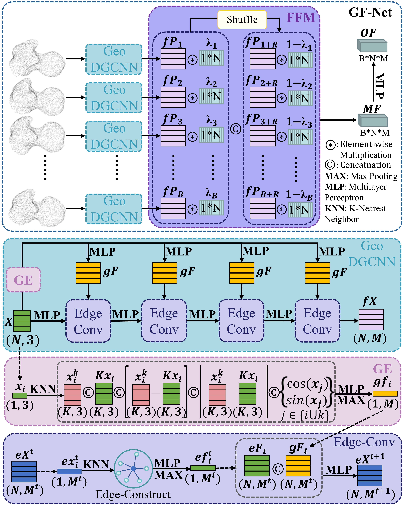
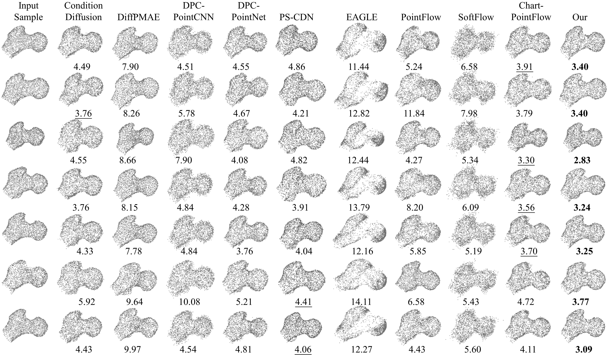
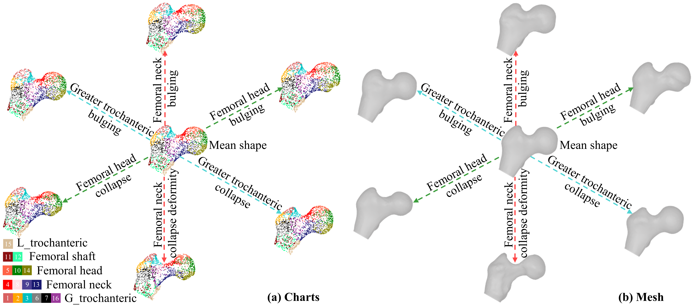
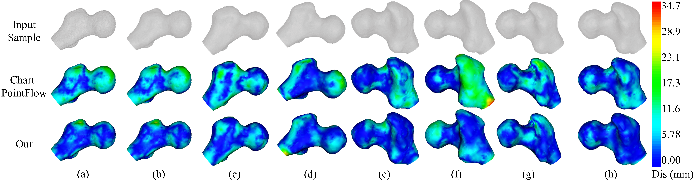

# LCSM
LCSM: A Local Chart-based Statistical Model for Femoral Shape Analysis

**Upon acceptance of the paper, we will make the LCSM code, network weights, and the public datasets publicly available.**

  
   
  <em>Fig 1：Architectures and data flow during the training, and the Reconstruction phase.</em>

  
   
  <em>Fig 2：Architectures of GF-Net.</em>

  
   
  <em>Fig 3：The reconstruction results visualization, showing the MMD-EMD metrics below each image in mm. The best performance is indicated by bold, and the second best by underline.</em>

  
   
  <em>Fig 4：The SSM results of the femoral model are presented as (a) chart visualizations and (b) mesh visualizations. In both (a) and (b), the mean shape, variations in the femoral neck, greater trochanter, and femoral head are shown, respectively. L_trochanter means lesser trochanter, and G_trochanter means greater trochanter.</em>

  
   
  <em>Fig 5：Mesh error visualization results were obtained by converting the point clouds into meshes using Poisson reconstruction.</em>

